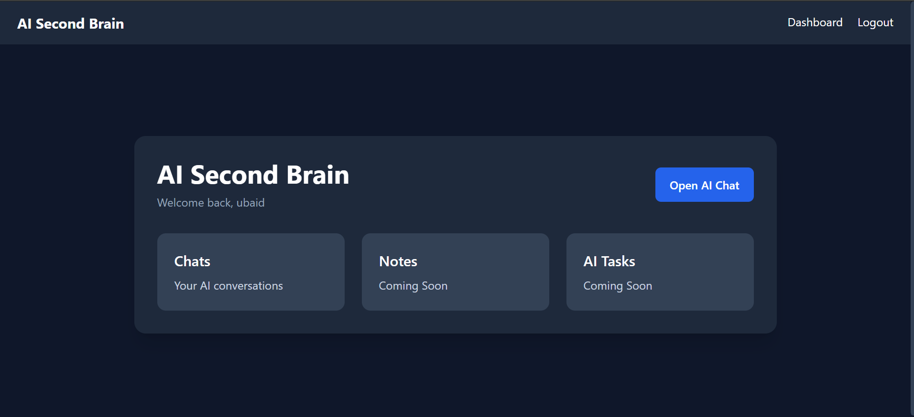
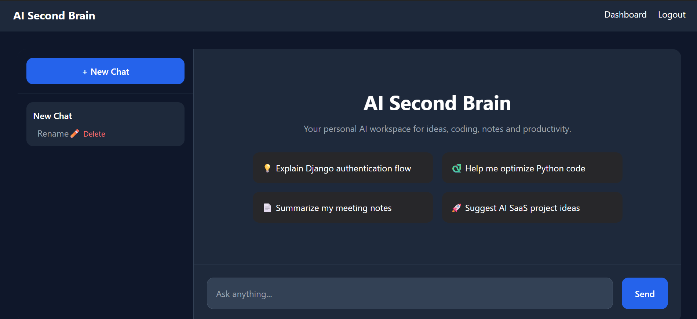
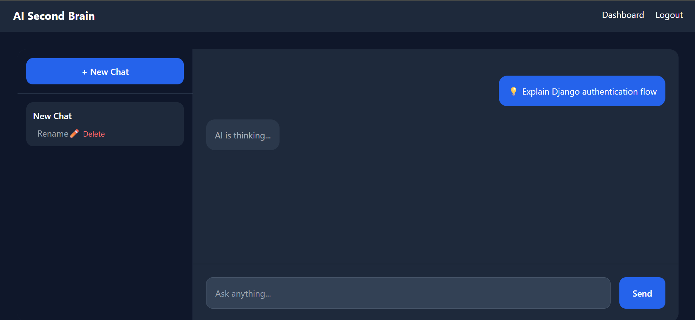
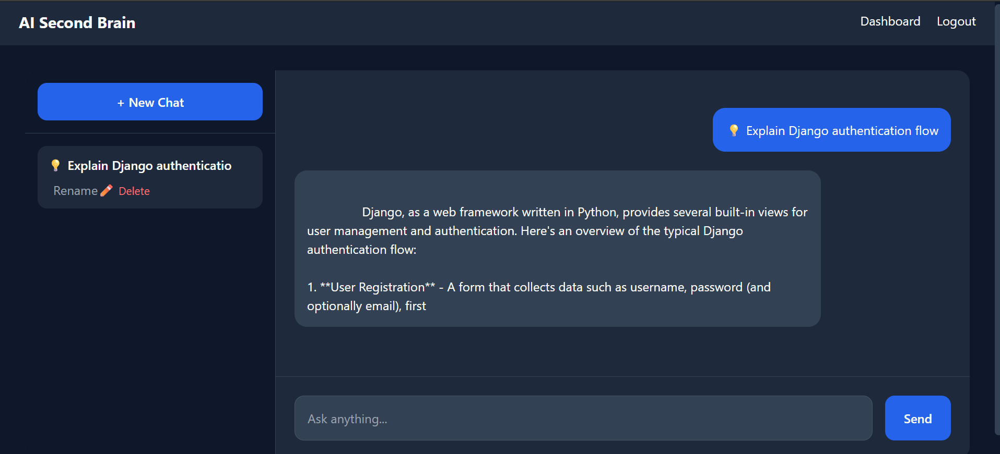
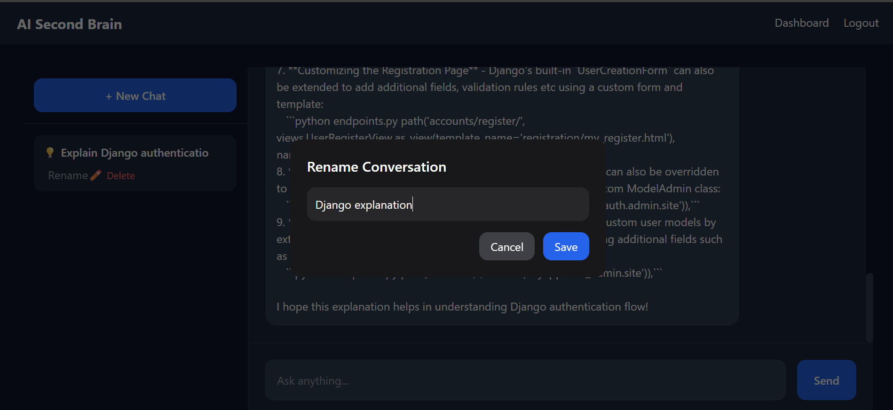

# AI Second Brain

AI Second Brain is a modern Django-based AI chat application powered by local LLM integration using Ollama.  
The project focuses on creating a clean and responsive AI assistant experience with persistent conversations, modern UI interactions, and lightweight AI workflows.

---

# Features

- User Authentication System
  - Signup
  - Login
  - Logout

- AI Chat Interface
  - Real-time chat experience
  - Local AI integration using Ollama
  - Progressive streaming-style AI responses

- Conversation Management
  - Create new chats
  - Persistent conversation history
  - Rename conversations dynamically
  - Delete conversations

- Modern UI/UX
  - Responsive dark-themed interface
  - Empty-state hero section
  - Suggested prompts
  - Smooth scrolling chat layout
  - Loading indicators
  - TailwindCSS styling

- Database Integration
  - SQLite database
  - Persistent message storage
  - Conversation-based chat architecture

- JavaScript Enhancements
  - Async fetch requests
  - Dynamic DOM updates
  - Modal-based interactions
  - Live UI updates without refresh

---

# Tech Stack

- HTML5
- Python
- Django
- SQLite
- JavaScript
- TailwindCSS
- Ollama
- Phi3 Local LLM

---

# Screenshots

## Dashboard


## New Chat Interface


## AI Thinking State


## Streaming Response


## Rename Conversation Modal


---

# Installation

## Clone Repository

```bash
git clone https://github.com/ubaidjavaid1002/ai-second-brain.git
cd ai-second-brain
```

---

## Create Virtual Environment

```bash
python -m venv venv
```

---

## Activate Virtual Environment

### Windows

```bash
venv\Scripts\activate
```

---

## Install Dependencies

```bash
pip install -r requirements.txt
```

---

## Run Migrations

```bash
python manage.py migrate
```

---

## Start Django Server

```bash
python manage.py runserver
```

---

# Ollama Setup

Install Ollama:

https://ollama.com/

Pull Phi3 model:

```bash
ollama pull phi3
```

Run Ollama locally:

```bash
ollama serve
```

---

# Future Improvements

- Real-time token streaming
- Voice input support
- AI memory system
- Multi-model support
- File upload and analysis
- Cloud deployment

---

# Project Purpose

This project was built to explore modern AI-integrated web application workflows using Django and local LLMs while practicing full-stack development concepts and modern UI interactions.
